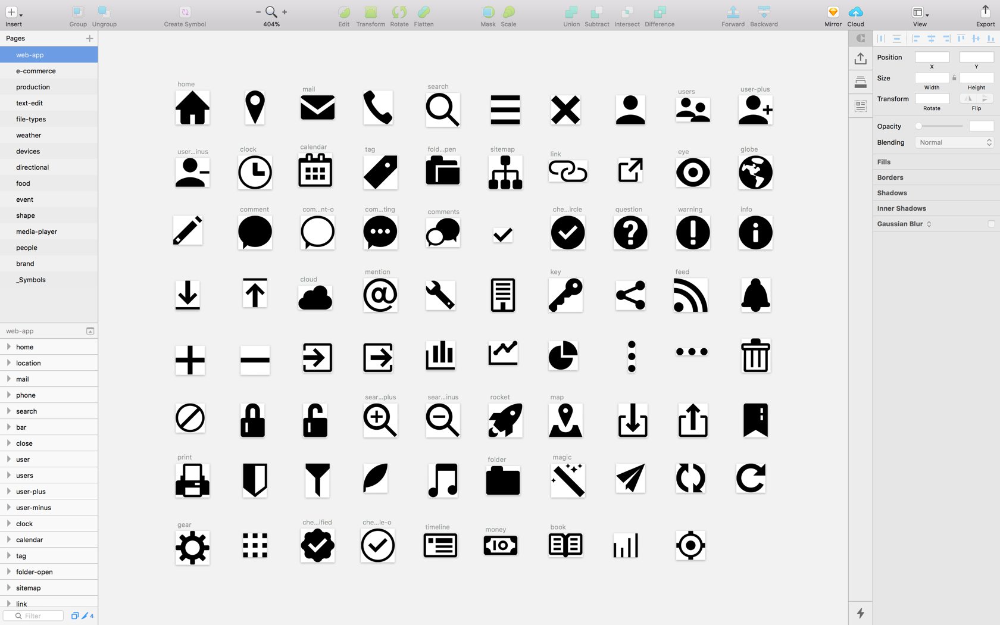

<h1 align="center">feathericon</h1>
<p align="center">feathericon is simple, scalable vector icon font for websites, apps.</p>
<div align="center">
  <a href="https://travis-ci.org/featherplain/feathericon">
    
  </a>
  <a href="https://npmjs.org/packages/feathericon">
    
  </a>
  <a href="https://npmjd.org/packages/feathericon">
    
  </a>
</div>
<p align="center">Website: <a href="http://feathericon.com">http://feathericon.com</a></p>

## Getting Started
1. Download **[ZIP folder from here](https://github.com/featherplain/feathericon/archive/master.zip)**.
1. Copy the entire `build/` directory to your project.
1. In the `<head>` of your html, reference the location to your `feathericon.min.css`.

  ```html
  <link rel="stylesheet" href="path/to/build/css/feathericon.min.css">
  ```
1. Place feathicon with `<i>` tag in your html like this. `fe` class is required to use our icons correctly. Check out [our website](http://feathericon.com) to start using icons!

  ```html
  <i class="fe fe-heart"></i>
  ```

### For developers
Install via [npm](https://npmjs.org).

```bash
$ npm install feathericon --save
```

You can simply point your Sass (SCSS) `include-path` at your `node_modules/` directory and import it like this in your scss file.

```scss
@import "feathericon/build/scss/feathericon";
```

## Customize feathericon
### 1. Edit Sketch document



Open the Sketch document in `src/feathericons.sketch`. Each icon exists as an artboard within the Sketch document. If you’re adding an icon, duplicate one of the artboards and add your shapes to it. **Be sure to give your artboard a name that makes sense**.

### 2. Build icons
#### Requires
- Node.js
- npm

You can download from the [Node.js download page](https://nodejs.org/en/download/), or [install via package managers](https://nodejs.org/en/download/package-manager/).
Node.js comes with npm ([See more](https://docs.npmjs.com/getting-started/installing-node)).

1. Open the `feathericon/` directory in Terminal.
1. Run this command to install dependencies for building icons.

  ```bash
  $ npm run setup
  ```
1. Run this command. Running the gulp task will generate the font, css, scss and SVGs, placing them in the `build/` directory.

  ```bash
  $ npm run webfont
  ```

## FontCustom
If you want to tweak font settings, edit `fontcustom.yml`. feathericon is using [FontCustom](https://github.com/FontCustom/fontcustom) to build fonts, stylesheets such as `feathericon.css` and `_feathericon.scss`. If you need more information for FontCustom, visit their GitHub Repository.


## Bugs, Ideas, Pull Requests
If you have any ideas or find bugs, please send me Pull Requests or let me know with GitHub Issues :)

## License
[MIT](https://github.com/featherplain/feathericon/blob/master/LICENSE) (C) 2016 Megumi Hano
